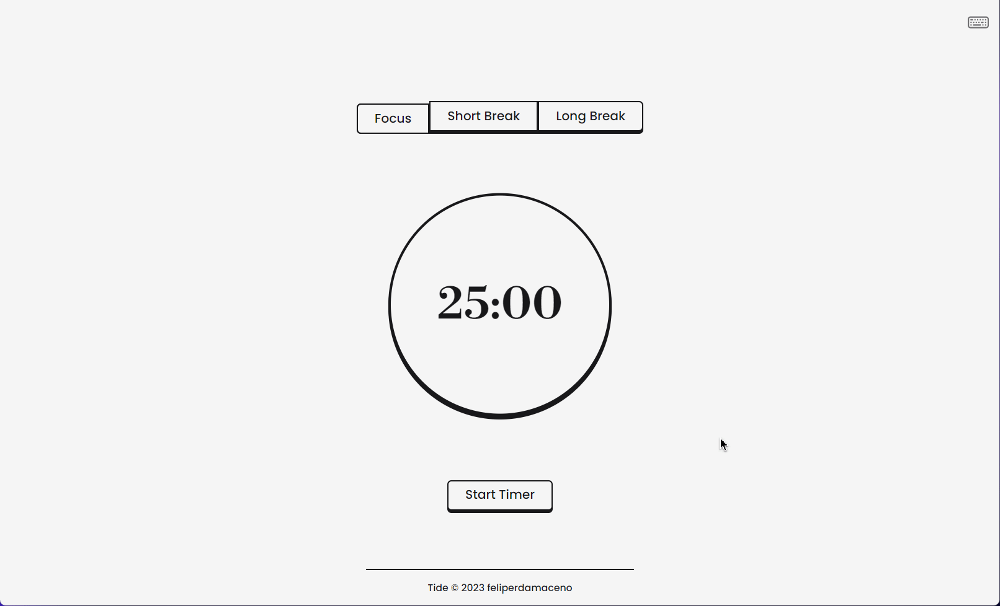

## Tide - A focus timer app

Tide is a Pomodoro timer Progressive Web App (PWA) designed to help you focus and be more productive. It uses the Pomodoro technique, a time management method that breaks work into 25-minute intervals (called Pomodoros) with short breaks in between. Tide provides an elegant and intuitive interface that makes it easy to use and stay on task, and it's accessible from any device with a web browser.

## Features

- Focus timer (25 minutes)
- Short break timer (5 minutes)
- Long break timer (15 minutes)
- Sound and notification at the end of each Focus/break
- Progressive Web App (PWA) technology, accessible from any device with a web browser
- Offline access

## Installation

Tide is a PWA and does not require any installation. Simply visit the Tide website on any device with a web browser and add it to your home screen for easy access.

[Demo Here](https://tide-focus-timer.netlify.app)

## Acknowledgments

Tide was inspired by the Pomodoro technique and built using React, TypeScript, Tailwind CSS and Service Workers.

## Licence

This is an open-source project and is available under the [**MIT License**](LICENSE). You are free to use, modify, and distribute the code in accordance with the terms of the license.

## Contributors

Contributions are highly appreciated! If you encounter any issues or have suggestions for improvements, please feel free to open an issue or submit a pull request.

[feliperdamaceno](https://github.com/feliperdamaceno)

## Contact me

Linkedin: [feliperdamaceno](https://www.linkedin.com/in/feliperdamaceno)
